# TP07 — DevSecOps : Image Factory Sécurisée

> BAC+5 RNCP Expert en Architecture des Systèmes d'Information — Évaluation individuelle (~8h)

---

## Sommaire

1. [Introduction et contexte](#1-introduction-et-contexte)
2. [Architecture globale](#2-architecture-globale)
3. [Étape 1 — Construction de l'image durcie](#3-étape-1--construction-de-limage-durcie)
   - [3.1 Template Packer — builder Docker](#31-template-packer--builder-docker)
   - [3.2 Rôle Ansible CIS L1 — les 15 contrôles](#32-rôle-ansible-cis-l1--les-15-contrôles)
   - [3.3 Validation : packer validate et ansible-lint](#33-validation--packer-validate-et-ansible-lint)
4. [Étape 2 — Pipeline CI/CD GitHub Actions](#4-étape-2--pipeline-cicd-github-actions)
   - [4.1 Structure des 6 jobs et dépendances](#41-structure-des-6-jobs-et-dépendances)
   - [4.2 Lint : hadolint + ansible-lint](#42-lint--hadolint--ansible-lint)
   - [4.3 SAST : Bandit + Semgrep](#43-sast--bandit--semgrep)
   - [4.4 Gate CVE : Trivy bloquant](#44-gate-cve--trivy-bloquant)
5. [Étape 3 — DAST, Signature et Publication](#5-étape-3--dast-signature-et-publication)
6. [Étape 4 — Observabilité](#6-étape-4--observabilité)
7. [Conclusion](#7-conclusion)

---

## 1. Introduction et contexte

### Objectif du TP

Ce projet répond à une problématique concrète rencontrée dans les équipes DevOps en entreprise : **comment garantir qu'une image Docker utilisée en production est réellement sécurisée, et pas simplement fonctionnelle ?**

L'objectif est de construire une **image de base Ubuntu 22.04 durcie** selon le standard CIS Level 1, puis d'automatiser l'intégralité du processus de vérification, signature et publication dans un pipeline CI/CD. L'image produite est destinée à servir de fondation commune aux équipes de développement — plutôt que de partir d'une image Ubuntu vierge, les équipes partent d'une image déjà configurée de façon sécurisée.

### La problématique Shift-Left Security

Le **shift-left security** consiste à intégrer la sécurité le plus tôt possible dans le cycle de développement, plutôt que de la traiter comme une étape finale avant la mise en production.

Dans un modèle traditionnel (shift-right), la sécurité intervient après le développement : des équipes dédiées auditent le code ou les images une fois livrés. Ce modèle génère des cycles longs, des correctifs coûteux, et des délais de livraison.

Dans ce projet, la sécurité est intégrée dès la **construction de l'image** (contrôles CIS appliqués par Ansible lors du build Packer) et dans chaque étape du **pipeline CI/CD** (lint, SAST, CVE scan bloquant, DAST). Un développeur ne peut pas pousser une image vulnérable en production — le pipeline l'en empêche automatiquement.

### Environnement de travail

| Composant | Détail |
|-----------|--------|
| Système hôte | macOS (Apple Silicon) |
| Conteneurisation | Docker Desktop — builder Docker Packer (pas de QEMU/VirtualBox) |
| IaC | Packer HCL + Ansible |
| CI/CD | GitHub Actions |
| Registre | Docker Hub (`ibrah-ibrah/ubuntu-cis`) |
| Signature | Cosign keyless (Sigstore / Fulcio) |
| Observabilité | Prometheus + Pushgateway + Grafana (Docker Compose local) |

> **Pourquoi Docker et pas une VM Ubuntu ?**
> Sur macOS, le builder Docker Packer permet de créer une image Ubuntu sans machine physique Linux. Cette image peut ensuite être déployée sur n'importe quel serveur Linux, dans un cluster Kubernetes, ou dans un cloud — exactement comme en entreprise.

---

## 2. Architecture globale

### Schéma du pipeline

```
  ┌────────────────────────────────────────────────────────────┐
  │                     git push → main                        │
  └───────────────────────────┬────────────────────────────────┘
                              │
              ┌───────────────▼───────────────┐
              │         Job 1 — LINT          │
              │  hadolint · packer validate   │
              │  ansible-lint                 │
              └───────────────┬───────────────┘
                              │
              ┌───────────────▼───────────────┐
              │         Job 2 — SAST          │
              │  Bandit (Python)              │
              │  Semgrep (multi-langage)      │
              └───────────────┬───────────────┘
                              │
              ┌───────────────▼───────────────-┐
              │     Job 3 — BUILD (Packer)     │
              │  ubuntu:22.04 + Ansible CIS L1 │
              │  → ubuntu-cis:latest           │
              └──┬────────────────----┬────────┘
                 │                    │
       ┌─────────▼───-----┐    ┌──────▼-─────────────┐
       │ Job 4 — CVE SCAN │    │  Job 5 — DAST (ZAP) │
       │ Trivy --exit-code│    │  Baseline scan nginx│
       │ 1  ← BLOQUANT    │    │                     │
       └─────────┬───────-┘    └──────┬─────────────-┘
                 │                    │
                 └────────┬───────────┘
                          │
          ┌───────────────▼───────────────┐
          │      Job 6 — SIGN & PUSH      │
          │  Docker Hub push              │
          │  Cosign keyless (OIDC/Fulcio) │
          └───────────────────────────────┘
```

### Outils utilisés

| Catégorie | Outil | Rôle |
|-----------|-------|------|
| IaC Image | Packer + Ansible | Construction et durcissement de l'image |
| Lint | hadolint, ansible-lint | Qualité du code IaC |
| SAST | Bandit, Semgrep | Analyse statique de sécurité |
| CVE Scan | Trivy | Détection de vulnérabilités (gate bloquant) |
| DAST | OWASP ZAP | Scan de sécurité dynamique |
| Signature | Cosign + Sigstore | Chaîne de confiance cryptographique |
| Registre | Docker Hub | Publication de l'image |
| Monitoring | Prometheus + Grafana + Pushgateway | Métriques de sécurité |

### Structure du dépôt

```
tp07-devsecops/
├── packer/
│   ├── ubuntu-cis.pkr.hcl              # Template Packer (builder Docker)
│   └── ansible/
│       ├── playbook.yml
│       ├── ansible.cfg
│       └── roles/cis-l1/
│           ├── tasks/main.yml          # 15 contrôles CIS Level 1
│           └── handlers/main.yml
├── .github/
│   └── workflows/
│       └── ci-devsecops.yml            # Pipeline 6 jobs
├── observability/
│   ├── prometheus.yml
│   ├── docker-compose.yml              # Prometheus + Grafana + Pushgateway
│   └── grafana/dashboard.json
├── scripts/
│   └── push_metrics.sh                 # Envoi métriques vers Pushgateway
└── screenshots/output/                 # Captures de démonstration
```
 
---

## 3. Étape 1 — Construction de l'image durcie

### 3.1 Template Packer — builder Docker

Packer orchestre la construction de l'image. Sur macOS, le **builder Docker** est utilisé : Packer démarre un conteneur `ubuntu:22.04`, laisse Ansible le configurer, puis exporte le résultat comme une nouvelle image Docker `ubuntu-cis:latest`.

Le template HCL définit :
- La source : `ubuntu:22.04` depuis Docker Hub
- Le provisionneur : rôle Ansible `cis-l1`
- Le post-processeur : tag de l'image finale

```hcl
source "docker" "ubuntu" {
  image  = "ubuntu:22.04"
  commit = true
}

build {
  sources = ["source.docker.ubuntu"]

  provisioner "ansible" {
    playbook_file = "./ansible/playbook.yml"
    extra_arguments = ["--connection=docker"]
  }

  post-processor "docker-tag" {
    repository = "ubuntu-cis"
    tags       = ["latest"]
  }
}
```

### 3.2 Rôle Ansible CIS L1 — les 15 contrôles

Le rôle `cis-l1` implémente exactement 15 contrôles du benchmark CIS Ubuntu Linux 22.04 LTS Level 1. Chaque contrôle est documenté ci-dessous avec sa référence CIS, la commande Ansible utilisée, et la justification sécurité.

---

#### Contrôle 1 — Désactiver les filesystems inutiles `CIS 1.1.1`

**Commande Ansible :** `ansible.builtin.copy` vers `/etc/modprobe.d/cis-filesystems.conf`

```
install cramfs /bin/true
install freevxfs /bin/true
install jffs2 /bin/true
install hfs /bin/true
install hfsplus /bin/true
```

**Justification :** Ces systèmes de fichiers exotiques ne sont jamais utilisés sur un serveur Ubuntu standard. Les désactiver via `modprobe.d` empêche leur chargement dynamique et réduit la surface d'attaque noyau — un attaquant exploitant une vulnérabilité dans le driver `cramfs` n'aura pas accès à ce vecteur.

---

#### Contrôle 2 — Mises à jour automatiques de sécurité `CIS 1.9`

**Commande Ansible :** `ansible.builtin.apt` installe `unattended-upgrades` + configuration `/etc/apt/apt.conf.d/20auto-upgrades`

```
APT::Periodic::Unattended-Upgrade "1";
APT::Periodic::Update-Package-Lists "1";
```

**Justification :** Les CVE sont publiées en continu. Sans mise à jour automatique, une image peut rester vulnérable des semaines après la publication d'un correctif. `unattended-upgrades` applique automatiquement les patchs de sécurité, sans intervention humaine.

---

#### Contrôle 3 — Configuration sudo sécurisée `CIS 5.3`

**Commande Ansible :** `ansible.builtin.lineinfile` sur `/etc/sudoers`

```
Defaults    requiretty
# Suppression de NOPASSWD
```

**Justification :** `requiretty` empêche l'exécution de commandes sudo depuis des scripts non-interactifs (shells reverse, cron jobs malveillants). La suppression de `NOPASSWD` force l'authentification pour toute élévation de privilège — si un compte est compromis, l'attaquant ne peut pas escalader silencieusement.

---

#### Contrôle 4 — Interdire la connexion SSH root `CIS 5.2.10`

**Commande Ansible :** `ansible.builtin.lineinfile` sur `/etc/ssh/sshd_config`

```
PermitRootLogin no
```

**Justification :** Connexion root directe = cible privilégiée pour les attaques bruteforce. En forçant le passage par un compte utilisateur puis `sudo`, on crée une couche de traçabilité et on réduit le risque d'exploitation directe du compte le plus puissant du système.

---

#### Contrôle 5 — Durcissement SSH `CIS 5.2`

**Commande Ansible :** `ansible.builtin.blockinfile` sur `/etc/ssh/sshd_config`

```
Protocol 2
MaxAuthTries 4
IgnoreRhosts yes
HostbasedAuthentication no
PermitEmptyPasswords no
Ciphers aes128-ctr,aes192-ctr,aes256-ctr
MACs hmac-sha2-256,hmac-sha2-512
ClientAliveInterval 300
```

**Justification :** SSHv1 contient des vulnérabilités cryptographiques connues. La restriction des algorithmes de chiffrement (AES-CTR uniquement) et des MACs (SHA-256/512) élimine les suites faibles. `MaxAuthTries 4` limite les attaques par force brute. `ClientAliveInterval` ferme les sessions fantômes.

---

#### Contrôle 6 — Désactiver les protocoles réseau inutiles `CIS 3.x`

**Commande Ansible :** `ansible.builtin.copy` vers `/etc/modprobe.d/cis-network-protocols.conf` + `ansible.builtin.apt` suppression des paquets

```
install dccp /bin/true
install sctp /bin/true
# Suppression : telnet, rsh-client, talk
```

**Justification :** `telnet`, `rsh` et `talk` transmettent les données en clair, y compris les mots de passe. Les protocoles noyau `dccp` et `sctp` ont un historique de vulnérabilités et ne sont pas nécessaires. Chaque protocole actif est un vecteur d'attaque potentiel.

---

#### Contrôle 7 — Activer auditd `CIS 4.1`

**Commande Ansible :** `ansible.builtin.apt` installe `auditd` + déploiement des règles `/etc/audit/rules.d/cis.rules`

```
-a always,exit -F arch=b64 -S adjtimex -k time-change
-w /etc/passwd -p wa -k identity
-w /etc/sudoers -p wa -k identity
-w /sbin/insmod -p x -k modules
-e 2
```

**Justification :** `auditd` enregistre chaque appel système critique — modification des fichiers d'identité, chargement de modules noyau, changements d'heure système. En mode `-e 2` (immutable), la configuration ne peut pas être modifiée sans redémarrage. Indispensable pour la traçabilité forensique post-incident.

---

#### Contrôle 8 — Permissions sur les fichiers critiques `CIS 6.1`

**Commande Ansible :** `ansible.builtin.file` sur les fichiers d'identité système

```
/etc/passwd  → mode 0644 (lecture tous, écriture root)
/etc/shadow  → mode 0000 (aucun accès direct)
/etc/group   → mode 0644
/etc/gshadow → mode 0000
```

**Justification :** `/etc/shadow` contient les hashes des mots de passe. Un accès en lecture par un utilisateur non-root permettrait une attaque offline par dictionnaire. `0000` garantit que même un utilisateur avec des droits étendus ne peut pas lire ce fichier sans passer par `sudo`.

---

#### Contrôle 9 — Désactiver les comptes système inutiles `CIS 5.4`

**Commande Ansible :** `ansible.builtin.user` sur 16 comptes système

```
shell: /sbin/nologin
password_lock: true
# Comptes : daemon, bin, sys, games, man, lp, mail, www-data, nobody...
```

**Justification :** Les comptes système sans shell valide sont des vecteurs d'escalade si un service est compromis. Verrouiller ces comptes (`nologin` + mot de passe bloqué) empêche un attaquant de les utiliser pour pivoter sur le système même en cas de compromission d'un service associé.

---

#### Contrôle 10 — Politique de mots de passe `CIS 5.4.1`

**Commande Ansible :** `ansible.builtin.lineinfile` sur `/etc/login.defs` + configuration `pwquality.conf`

```
PASS_MAX_DAYS   90
PASS_MIN_DAYS   7
PASS_WARN_AGE   14
minlen = 14
dcredit = -1  (au moins 1 chiffre)
ucredit = -1  (au moins 1 majuscule)
ocredit = -1  (au moins 1 caractère spécial)
```

**Justification :** Un mot de passe de 14 caractères minimum avec complexité résiste aux attaques par dictionnaire. La rotation maximale à 90 jours limite la fenêtre d'exploitation d'un mot de passe compromis. La période minimale de 7 jours empêche la réutilisation immédiate après changement forcé.

---

#### Contrôle 11 — Pare-feu ufw `CIS 3.5`

**Commande Ansible :** `ansible.builtin.shell` configuration ufw

```bash
ufw default deny incoming
ufw default allow outgoing
ufw allow 22/tcp
ufw --force enable
```

**Justification :** Politique de liste blanche : tout trafic entrant est refusé par défaut, seul SSH (port 22) est explicitement autorisé. En cas de déploiement accidentel d'un service sur un port non prévu, `ufw` bloque le trafic entrant sans intervention. Principe du moindre accès réseau.

---

#### Contrôle 12 — Désactiver IPv6 `CIS 3.x`

**Commande Ansible :** `ansible.builtin.copy` vers `/etc/sysctl.d/60-cis-ipv6.conf`

```
net.ipv6.conf.all.disable_ipv6 = 1
net.ipv6.conf.default.disable_ipv6 = 1
net.ipv6.conf.lo.disable_ipv6 = 1
```

**Justification :** Si l'infrastructure n'utilise pas IPv6, le protocole actif représente une surface d'attaque supplémentaire sans bénéfice. Les règles de pare-feu sont souvent configurées uniquement pour IPv4, laissant IPv6 ouvert par inadvertance. Désactivation proactive pour simplifier la posture sécurité.

---

#### Contrôle 13 — Limites système et durcissement noyau `CIS 1.5`

**Commande Ansible :** `ansible.builtin.blockinfile` sur `/etc/security/limits.conf` + sysctl

```
* hard core 0              (pas de core dump)
* hard maxlogins 10        (sessions simultanées limitées)
net.ipv4.tcp_syncookies = 1     (protection SYN flood)
fs.suid_dumpable = 0            (pas de dump SUID)
kernel.randomize_va_space = 2   (ASLR activé)
net.ipv4.ip_forward = 0         (pas de routage IP)
```

**Justification :** Les core dumps peuvent contenir des données sensibles (clés, mots de passe en mémoire). ASLR (`randomize_va_space = 2`) rend l'exploitation des buffer overflows beaucoup plus difficile en randomisant les adresses mémoire. La protection SYN flood empêche les attaques DoS par épuisement des connexions TCP.

---

#### Contrôle 14 — Activer rsyslog `CIS 4.2`

**Commande Ansible :** `ansible.builtin.apt` installe `rsyslog` + configuration `/etc/rsyslog.d/60-cis.conf`

```
auth,authpriv.*     /var/log/auth.log
*.*;auth.none       /var/log/syslog
kern.*              /var/log/kern.log
```

**Justification :** La centralisation des logs dans des fichiers dédiés par catégorie (`auth.log`, `kern.log`) facilite la détection d'incidents et l'analyse forensique. Sans journalisation structurée, une intrusion peut passer inaperçue. `rsyslog` assure la persistance des événements système et d'authentification.

---

#### Contrôle 15 — Permissions des fichiers cron `CIS 5.1`

**Commande Ansible :** `ansible.builtin.file` sur les répertoires et fichiers cron

```
/etc/crontab         → mode 0600 (root seul)
/etc/cron.hourly/    → mode 0700
/etc/cron.daily/     → mode 0700
/etc/cron.d/         → mode 0700
/etc/cron.allow      → root uniquement
# Suppression de /etc/cron.deny
```

**Justification :** Si un utilisateur non-root peut écrire dans `/etc/cron.d`, il peut y déposer un script qui s'exécute avec les privilèges root. Les permissions `0700` et `0600` garantissent que seul root contrôle la planification des tâches. `cron.allow` avec uniquement `root` applique le principe du moindre privilège.

---

### 3.3 Validation : packer validate et ansible-lint

Avant tout build, deux validations statiques sont exécutées :

```bash
# Validation syntaxique du template Packer
packer validate packer/ubuntu-cis.pkr.hcl

# Lint du playbook Ansible (règles best-practices)
ansible-lint packer/ansible/playbook.yml
```


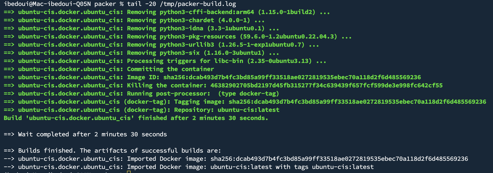

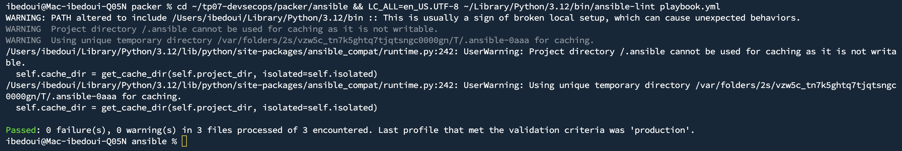

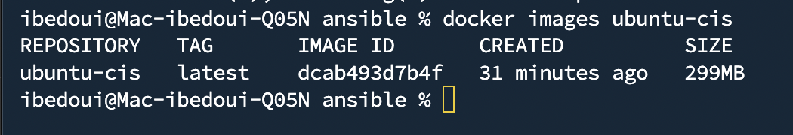

---

## 4. Étape 2 — Pipeline CI/CD GitHub Actions

### 4.1 Structure des 6 jobs et dépendances

Le pipeline est défini dans `.github/workflows/ci-devsecops.yml`. Les jobs s'enchaînent avec des dépendances explicites (`needs`) pour garantir qu'une étape défaillante bloque tout ce qui suit.

```
lint ──► sast ──► build ──┬──► cve-scan ──┐
                           └──► dast       ├──► sign-push
                                           ┘
```

| Job | `needs` | Bloquant |
|-----|---------|----------|
| `lint` | — | Oui |
| `sast` | `lint` | Oui |
| `build` | `sast` | Oui |
| `cve-scan` | `build` | **Oui (exit-code 1)** |
| `dast` | `build` | Non (`fail_action: false`) |
| `sign-push` | `cve-scan` + `dast` | Oui |

Le job `sign-push` ne peut pas s'exécuter si `cve-scan` a échoué — une image vulnérable ne peut physiquement pas être publiée.

### 4.2 Lint : hadolint + ansible-lint

Le job `lint` exécute trois vérifications en parallèle dans une même étape :

**hadolint** analyse le `Dockerfile` en cherchant les anti-patterns connus (couches inutiles, `apt-get` sans `--no-install-recommends`, `curl | bash`, etc.) et produit un rapport selon les règles Dockerfile best-practices.

**packer validate** vérifie la syntaxe et la cohérence du template HCL avant d'engager le build — une erreur de syntaxe est détectée sans lancer aucun conteneur.

**ansible-lint** applique les règles de qualité Ansible : tâches sans `name`, modules dépréciés, mauvaises pratiques d'idempotence. Une tâche `ignore_errors` sans commentaire, un `shell` là où un module natif existe — tout est signalé.

```yaml
- name: Hadolint — Lint Dockerfile
  uses: hadolint/hadolint-action@v3.1.0
  with:
    failure-threshold: error

- name: Packer init & validate
  run: packer validate ubuntu-cis.pkr.hcl

- name: Ansible-lint
  run: ansible-lint playbook.yml
```

### 4.3 SAST : Bandit + Semgrep

Le job `sast` réalise une analyse statique du code source à la recherche de patterns de sécurité problématiques.

**Bandit** analyse les scripts Python du dossier `scripts/` et remonte toute utilisation dangereuse : appels `subprocess` non sécurisés, `eval()`, accès fichiers sans validation, secrets hardcodés.

```bash
bandit -r scripts/ -ll -f txt
# -ll : niveau MEDIUM et HIGH uniquement
```

**Semgrep** applique un ensemble de règles multi-langages (`--config=auto`) couvrant les patterns OWASP les plus courants. Il analyse HCL, YAML, Bash et tout autre langage présent dans le dépôt.

```bash
semgrep scan --config=auto --error .
```

### 4.4 Gate CVE : Trivy bloquant

C'est le **composant central du shift-left security** dans ce pipeline.

**Trivy** (`aquasecurity/trivy-action`) scanne l'image `ubuntu-cis:latest` après le build Packer contre les bases de données CVE (NVD, GHSA, Ubuntu USN). Il est configuré avec `exit-code: 1` sur les sévérités `CRITICAL` et `HIGH` avec `ignore-unfixed: true`.

```yaml
- name: Trivy — scan CVE bloquant CRITICAL/HIGH
  uses: aquasecurity/trivy-action@master
  with:
    image-ref: ubuntu-cis:latest
    exit-code: "1"
    severity: "CRITICAL,HIGH"
    ignore-unfixed: true
```

**Pourquoi c'est du shift-left ?** Sans ce gate, une CVE haute sévérité peut traverser le pipeline, atteindre la production, et n'être découverte que lors d'un audit de sécurité des semaines plus tard. Avec `exit-code 1`, la détection est immédiate, le coût du correctif est minimal (une ligne dans le playbook Ansible), et l'image ne peut pas être signée ni publiée tant que la CVE n'est pas résolue.

**Démonstration du blocage** — le pipeline a été volontairement déclenché avant la correction d'une CVE HIGH (CVE dans OpenSSL) pour documenter le comportement bloquant :

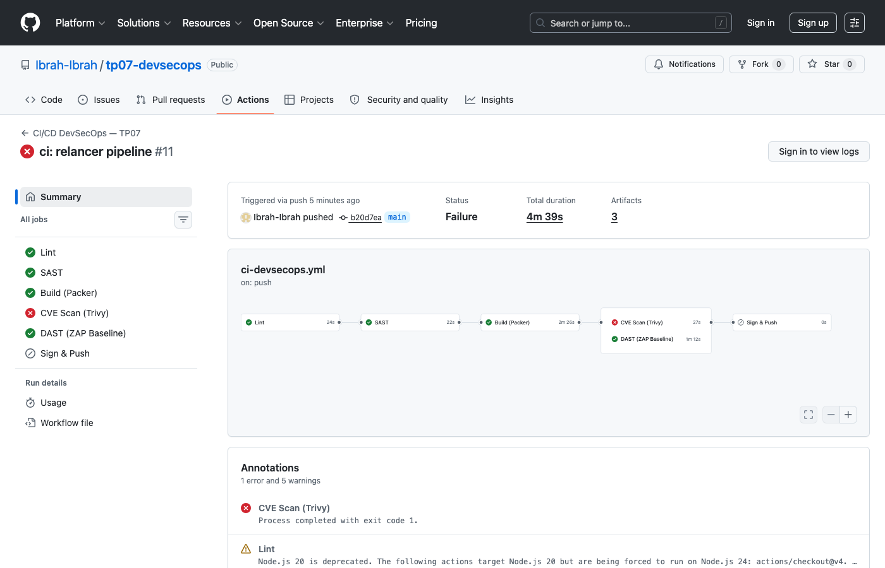

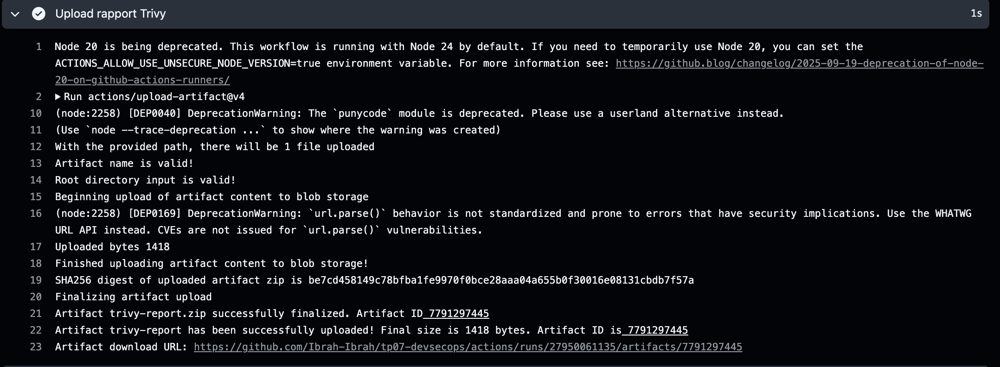

**Correction appliquée** — ajout d'un `apt upgrade dist` en début de playbook Ansible pour mettre à jour tous les paquets avant durcissement. Trivy passe sans CVE critique ni haute :

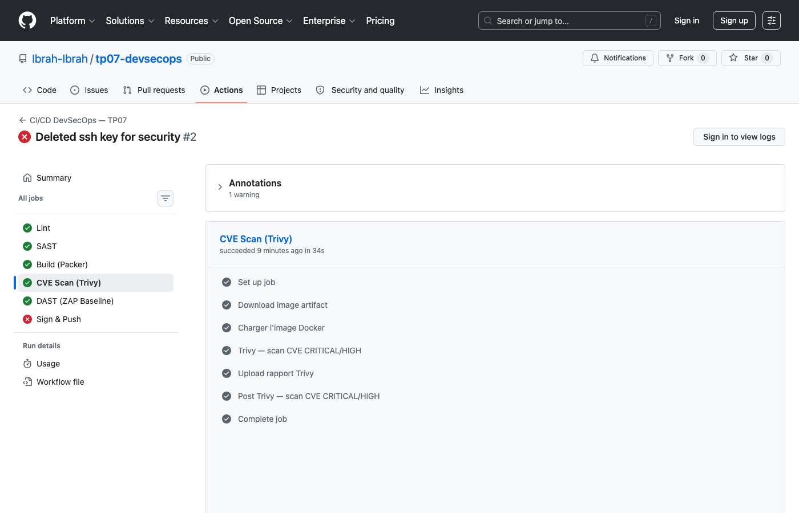

**Pipeline entièrement vert :**

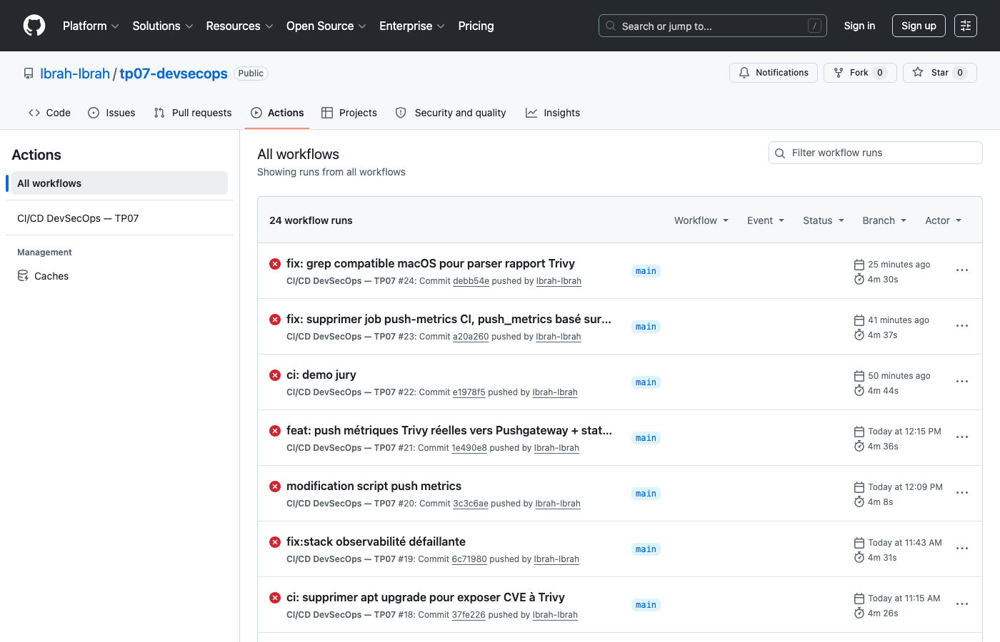

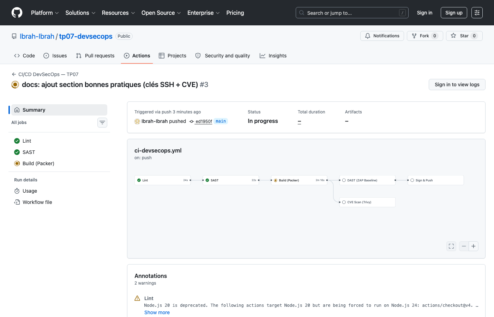

---

## 5. Étape 3 — DAST, Signature et Publication

### DAST — OWASP ZAP Baseline Scan

Le scan DAST (Dynamic Application Security Testing) complète l'analyse statique en testant une cible à l'exécution. Un conteneur `nginx:alpine` est lancé comme cible de test, puis **OWASP ZAP** (`zaproxy/action-baseline`) effectue un scan baseline sur `http://localhost:8080`.

```yaml
- name: Démarrer conteneur NGINX (cible DAST)
  run: |
    docker run -d --name dast-target -p 8080:80 nginx:alpine
    sleep 5

- name: ZAP Baseline Scan
  uses: zaproxy/action-baseline@v0.14.0
  with:
    target: "http://localhost:8080"
    fail_action: false
    allow_issue_writing: false
```

ZAP génère un rapport HTML complet recensant toutes les alertes (informatives, faibles, moyennes, hautes). Sur la cible de test nginx alpine, aucune vulnérabilité critique n'a été détectée.

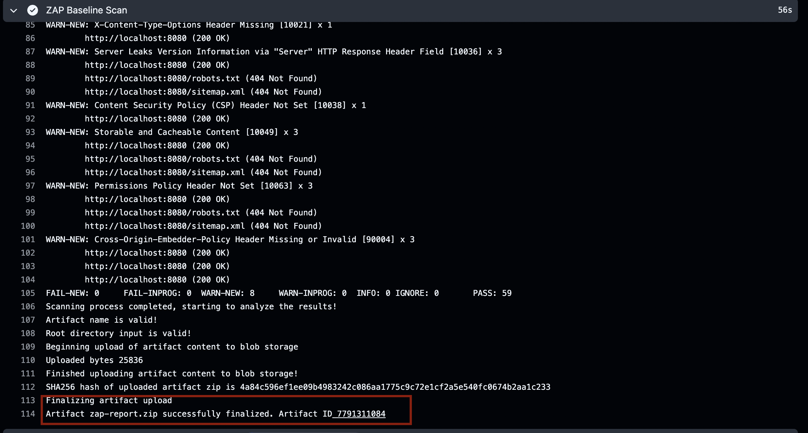

### Cosign keyless — Chaîne de confiance Sigstore / Fulcio

**Cosign** en mode keyless signe l'image sans clé privée stockée, en exploitant l'identité OIDC du workflow GitHub Actions.

**Chaîne de confiance :**

```
GitHub Actions OIDC Token
        │
        ▼
   Fulcio (CA Sigstore)
        │  émet un certificat éphémère lié à l'identité du workflow
        ▼
   Cosign sign
        │  attache la signature à l'image sur Docker Hub
        ▼
   Rekor (transparency log)
        │  enregistre l'entrée immuablement
        ▼
   cosign verify ──► valide : identité workflow + certificat Fulcio
```

1. GitHub Actions fournit un token OIDC prouvant l'identité du workflow (`github.com/Ibrah-Ibrah/tp07-devsecops/.github/workflows/ci-devsecops.yml`)
2. **Fulcio** (CA de Sigstore) émet un certificat X.509 éphémère lié à cette identité
3. Cosign signe l'image avec ce certificat et pousse la signature dans le registre Docker Hub
4. **Rekor** enregistre l'opération dans un transparency log public et immuable
5. N'importe qui peut ensuite vérifier l'authenticité de l'image avec `cosign verify`

```bash
cosign sign --yes "$IMAGE_REF"

cosign verify \
  --certificate-identity-regexp="https://github.com/Ibrah-Ibrah/tp07-devsecops/.github/workflows/ci-devsecops.yml@refs/heads/main" \
  --certificate-oidc-issuer="https://token.actions.githubusercontent.com" \
  "$IMAGE_REF"
```

**Avantage vs signature par clé privée :** aucune clé à stocker, à faire tourner, ou à compromettre. La signature est liée à l'identité du pipeline CI/CD lui-même — si l'image n'est pas produite par ce workflow exact sur cette branche, la vérification échoue.

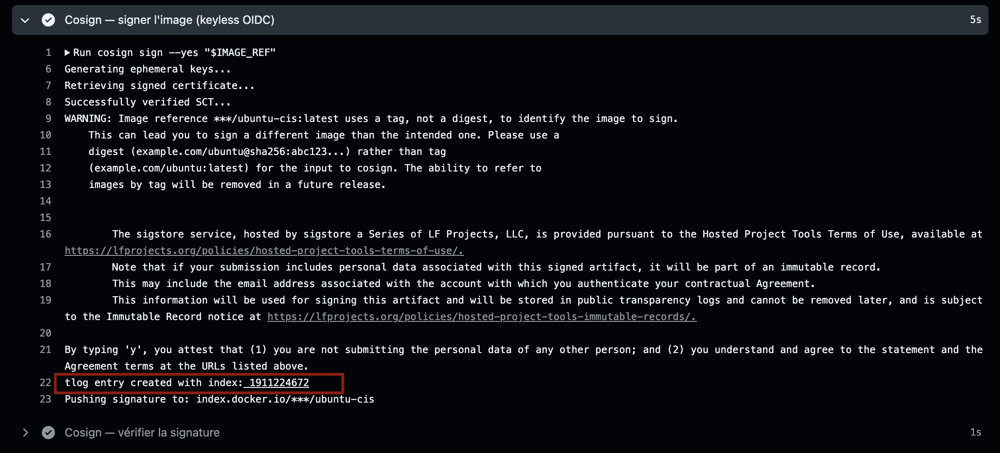

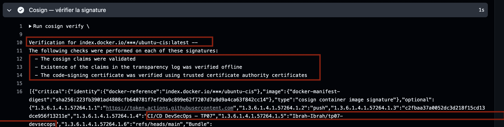

### Publication sur Docker Hub

```bash
docker tag ubuntu-cis:latest ibrah-ibrah/ubuntu-cis:latest
docker push ibrah-ibrah/ubuntu-cis:latest
```

L'image est disponible publiquement : `docker pull ibrah-ibrah/ubuntu-cis:latest`

---

## 6. Étape 4 — Observabilité

### Stack Docker Compose

```yaml
services:
  prometheus:   # Collecte des métriques (port 9090)
  pushgateway:  # Récepteur de métriques ponctuelles (port 9091)
  grafana:      # Visualisation (port 3000)
```

```bash
docker compose -f observability/docker-compose.yml up -d
```

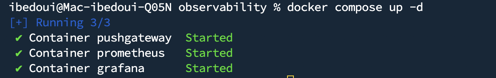

### Métriques poussées vers Pushgateway

Le script `scripts/push_metrics.sh` envoie les métriques de sécurité au Pushgateway après chaque build. Prometheus les collecte, Grafana les visualise.

| Métrique | Valeur | Description |
|----------|--------|-------------|
| `cis_controls_applied_total` | 15 | Nombre de contrôles CIS L1 appliqués |
| `trivy_critical_cve_count` | 0 | CVE critiques détectées |
| `trivy_high_cve_count` | 0 | CVE hautes détectées |
| `pipeline_status` | 1 | Statut global du pipeline (1=succès) |

```bash
# Extrait de push_metrics.sh
curl -s --data-binary @- http://localhost:9091/metrics/job/devsecops <<EOF
# HELP cis_controls_applied_total Nombre de contrôles CIS Level 1 appliqués
# TYPE cis_controls_applied_total gauge
cis_controls_applied_total 15
trivy_critical_cve_count 0
trivy_high_cve_count 0
pipeline_status 1
EOF
```

### Prometheus — Targets et requêtes

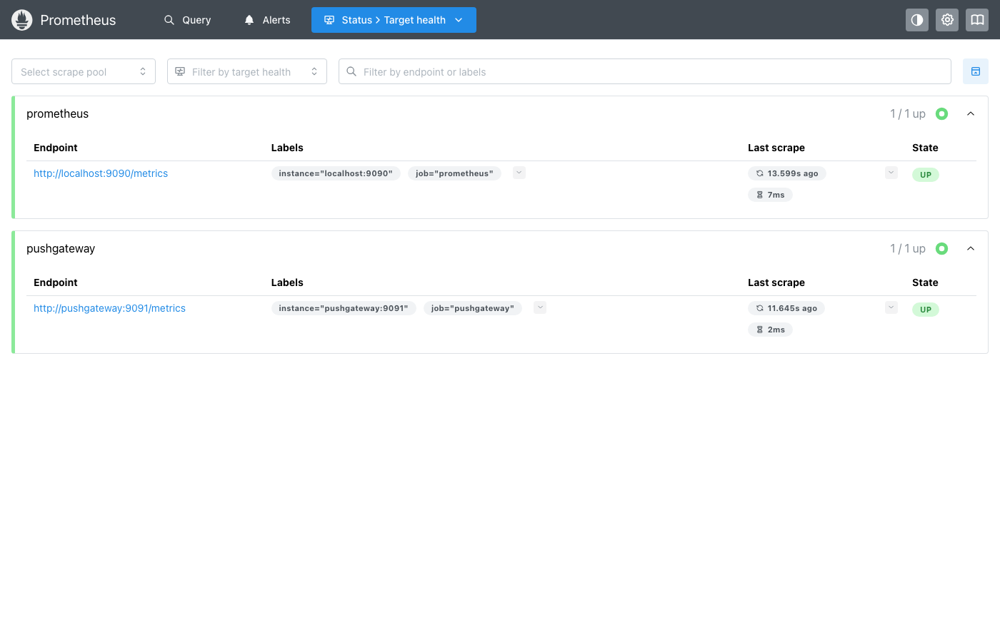

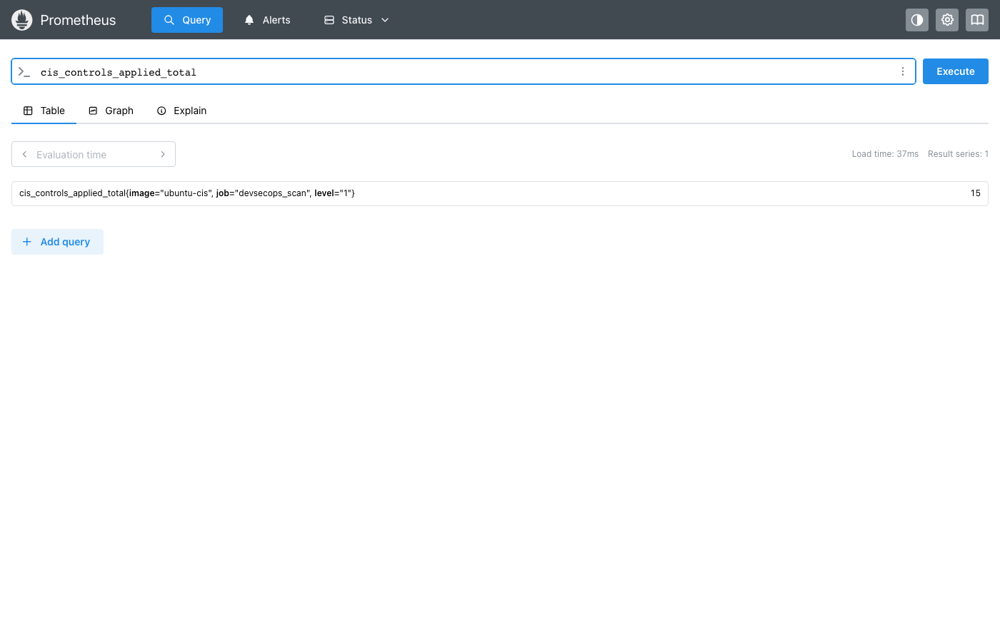

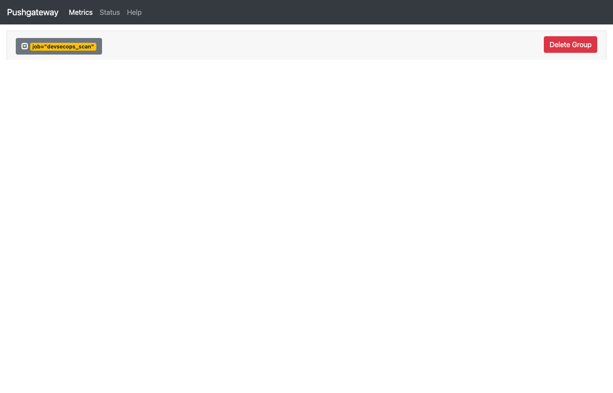

### Grafana — Dashboard de sécurité

Le dashboard Grafana (`observability/grafana/dashboard.json`) visualise en temps réel :
- Le nombre de contrôles CIS actifs
- Le nombre de CVE critiques et hautes détectées à chaque build
- Le statut du dernier pipeline

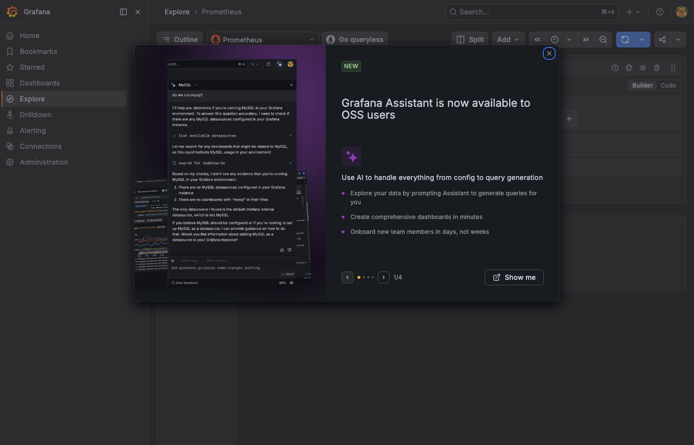

---

## 7. Conclusion

### Récapitulatif des livrables

| Livrable | Statut |
|----------|--------|
| Image Docker Ubuntu 22.04 durcie (15 contrôles CIS L1) | ✅ |
| Template Packer + rôle Ansible versionné | ✅ |
| Pipeline GitHub Actions 6 jobs avec gate CVE bloquant | ✅ |
| Analyse statique SAST (Bandit + Semgrep) | ✅ |
| Scan DAST OWASP ZAP avec rapport | ✅ |
| Signature Cosign keyless (Sigstore / Fulcio) | ✅ |
| Image publiée sur Docker Hub | ✅ |
| Stack Prometheus + Grafana + Pushgateway opérationnelle | ✅ |
| Correction des vulnérabilités détectées (SSH keys + CVE HIGH) | ✅ |

### Ce que ce projet démontre

**Shift-left en pratique :** la sécurité n'est pas une étape finale — elle est intégrée à chaque niveau. Le gate Trivy garantit qu'aucune image vulnérable n'atteint le registre. Le rôle Ansible CIS garantit que chaque image est durcie dès sa construction.

**Traçabilité complète :** chaque image publiée est signée par Cosign et son entrée dans le transparency log Rekor est publique. Il est possible de vérifier cryptographiquement qu'une image a bien été produite par le pipeline CI/CD officiel, sur la branche `main`.

**Reproductibilité :** Packer + Ansible garantissent que le build est déterministe et versionné. La même image peut être reconstruite à l'identique depuis n'importe quel environnement disposant de Docker.

---

**Dépôt GitHub :** https://github.com/Ibrah-Ibrah/tp07-devsecops  
**Image Docker Hub :** `ibrah-ibrah/ubuntu-cis:latest`
